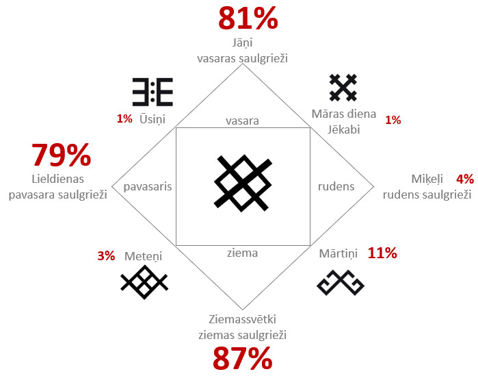

Gadskārtas
==========

← [Uz saturu](../README.md#saturs)

- [Svinētāju daļa](#svinētāju-daļa)
- [Ziemassvētki](#ziemassvētki)
- [Meteņi](#meteņi)
- [Lieldienas](#lieldienas)
- [Ūsiņi / Jurģu diena](#ūsiņi--jurģu-diena)
- [Jāņi](#jāņi)
- [Māras diena / Jēkabi](#māras-diena--jēkabi)
- [Miķeļi](#miķeļi)
- [Mārtiņi](#mārtiņi)

**TODO** aizpildīt svētkus

Svinētāju daļa
--------------

Saskanīgi ar [2018. gada pētījumu](
https://www.kantar.lv/newsletters/tnsab56/ka-mes-musdienas-svinam-latviesu-gadskartas-un-izjutam-latvietibu):

Ziemassvētki
------------

Ziemas saulgriežu un Jēzus Kristus dzimšanas svētki.

Meteņi
------

Lieldienas
----------

Ūsiņi / Jurģu diena
-------------------

Jāņi
----

Māras diena / Jēkabi
--------------------

Miķeļi
------

Mārtiņi
-------

